# Travel-Bucket-List

Travel-Bucket is a smart travel bucket list android app developed using Flutter and AWS Lambda.

## Screenshots

### Home Page
&nbsp;&nbsp;&nbsp; 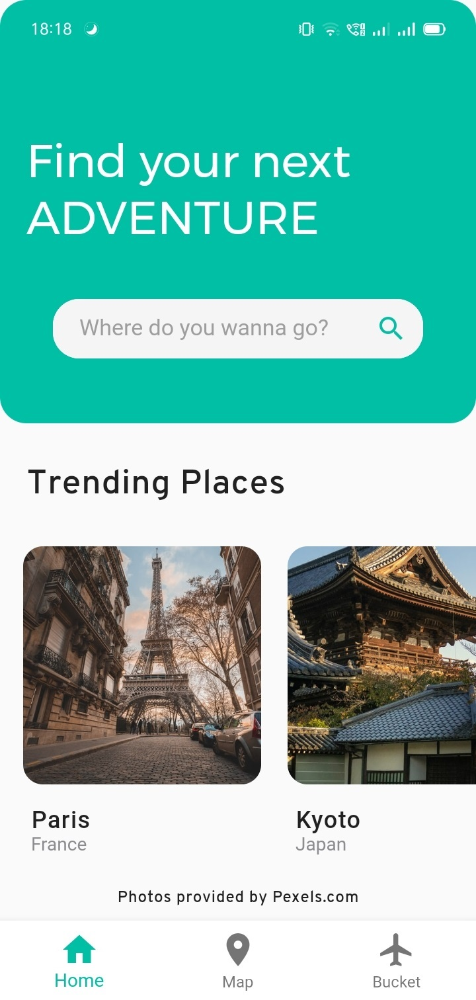&nbsp;&nbsp;&nbsp;  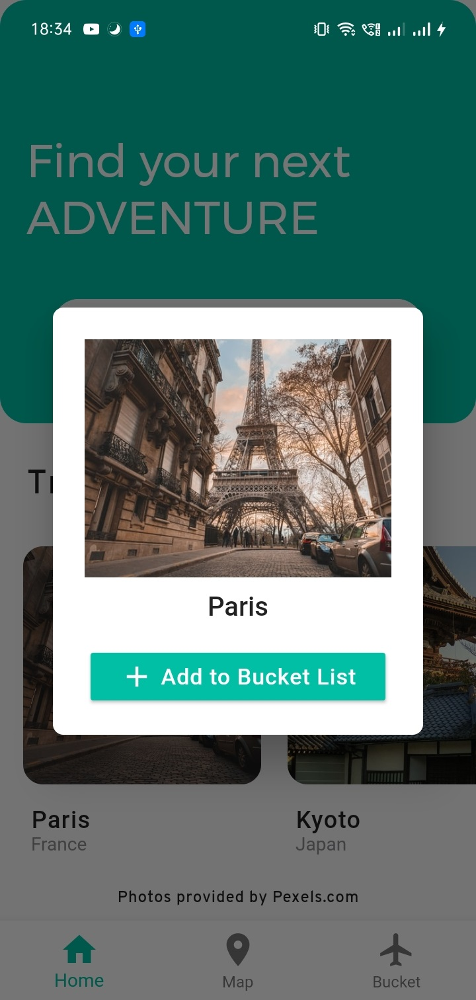

### Search Page
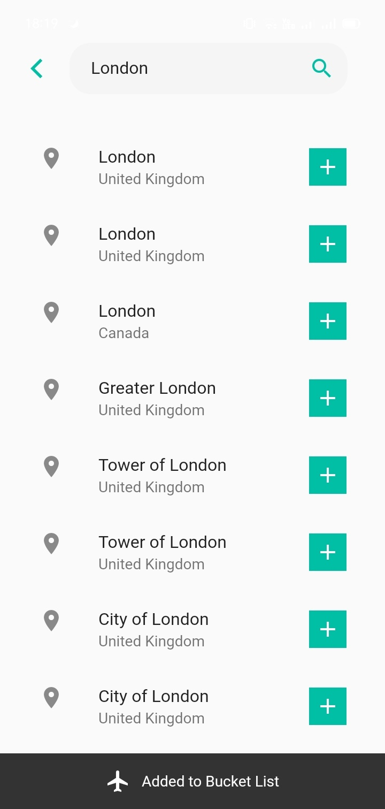 

### Map Page (With Light and Dark Modes)
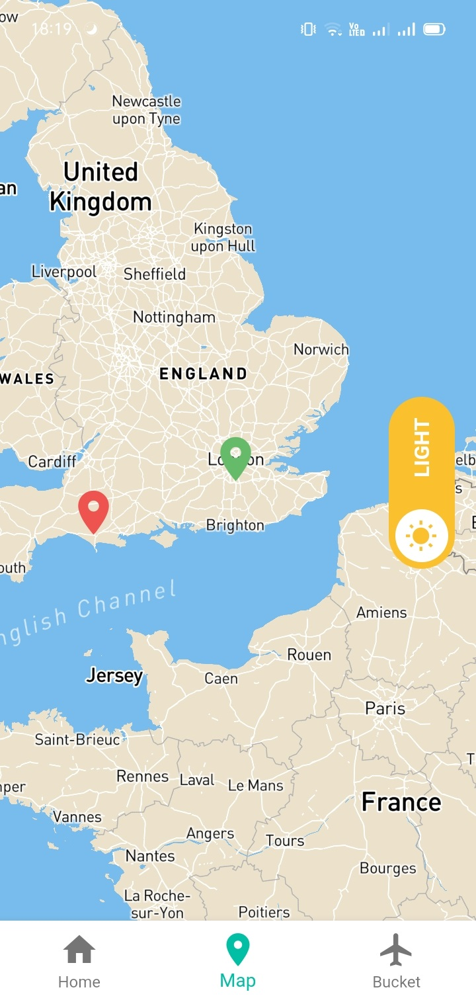&nbsp;&nbsp;&nbsp; 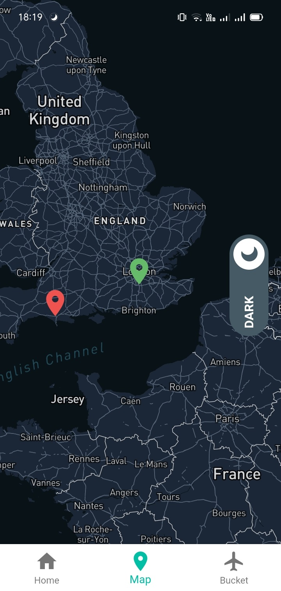 

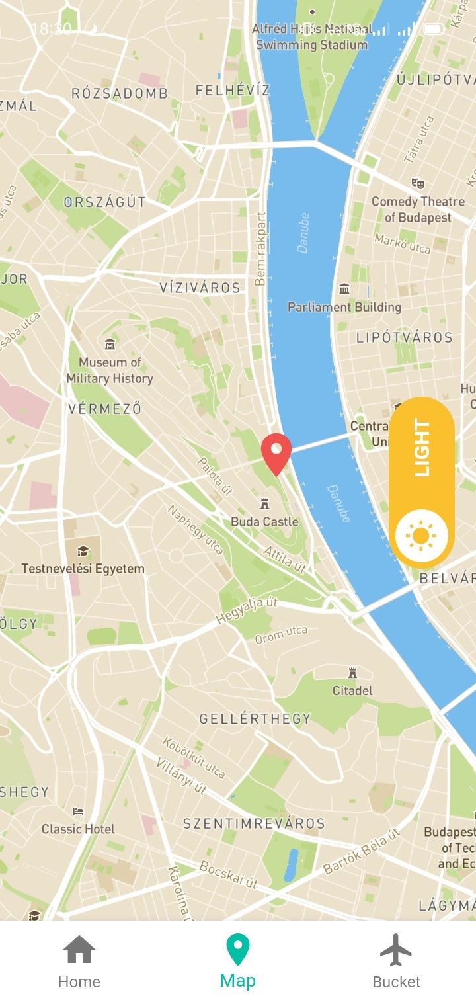&nbsp;&nbsp;&nbsp; 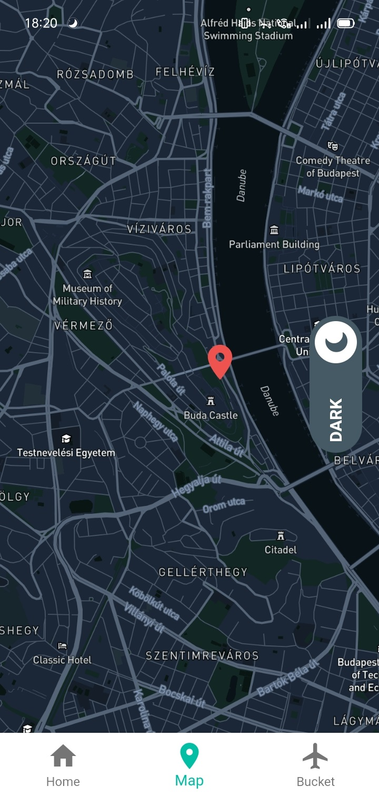 

### Bucket List Page

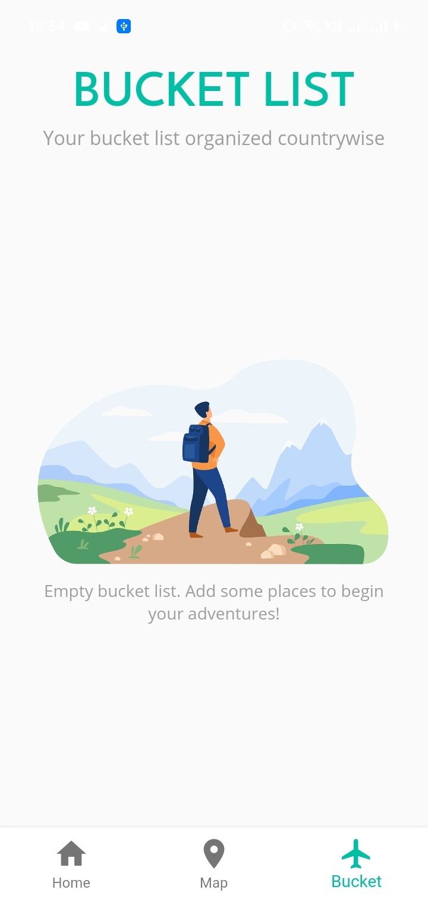&nbsp;&nbsp;&nbsp;  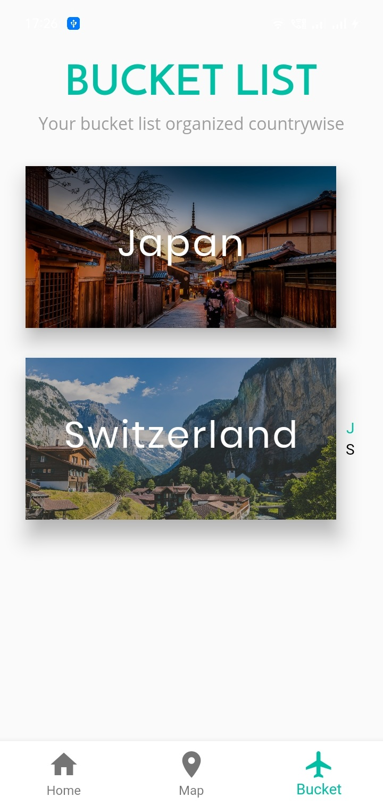 

### Country Pages
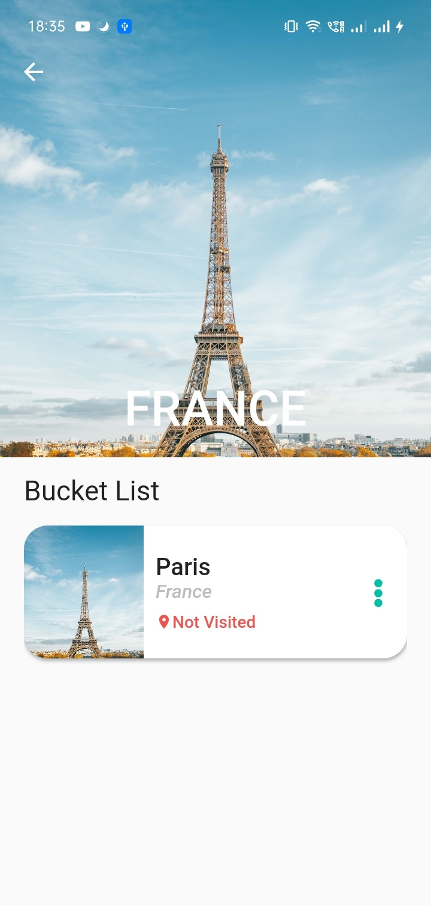&nbsp;&nbsp;&nbsp; 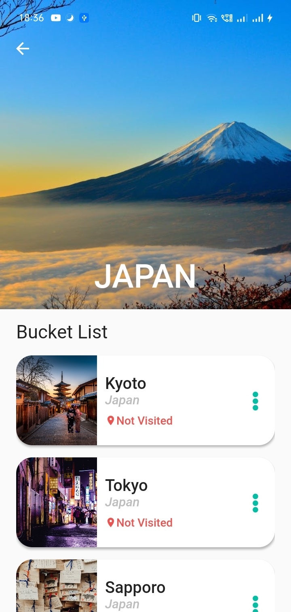 
